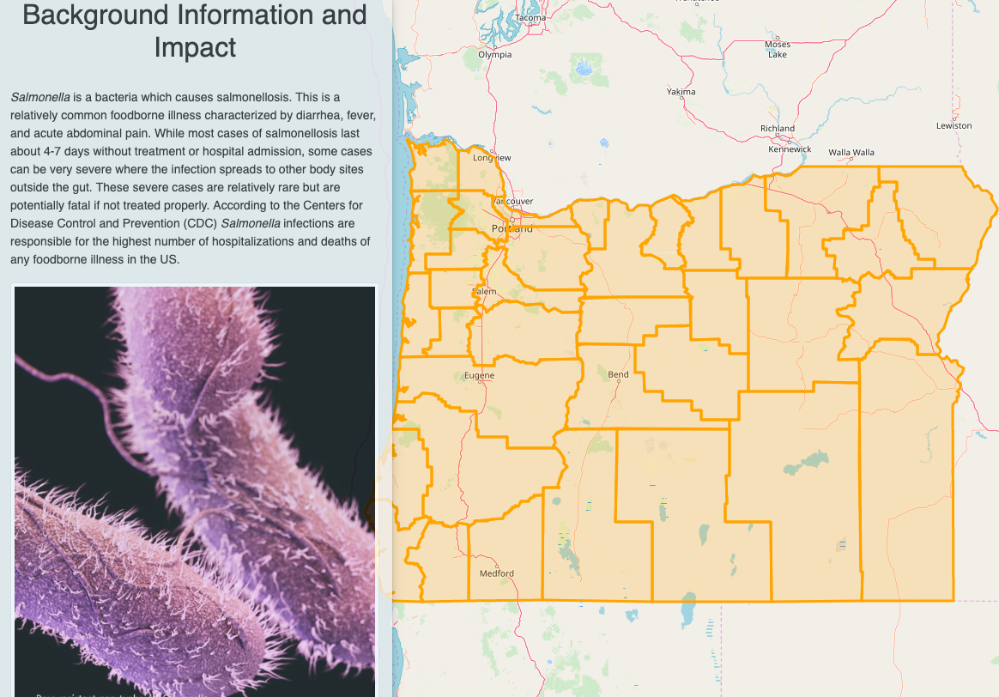
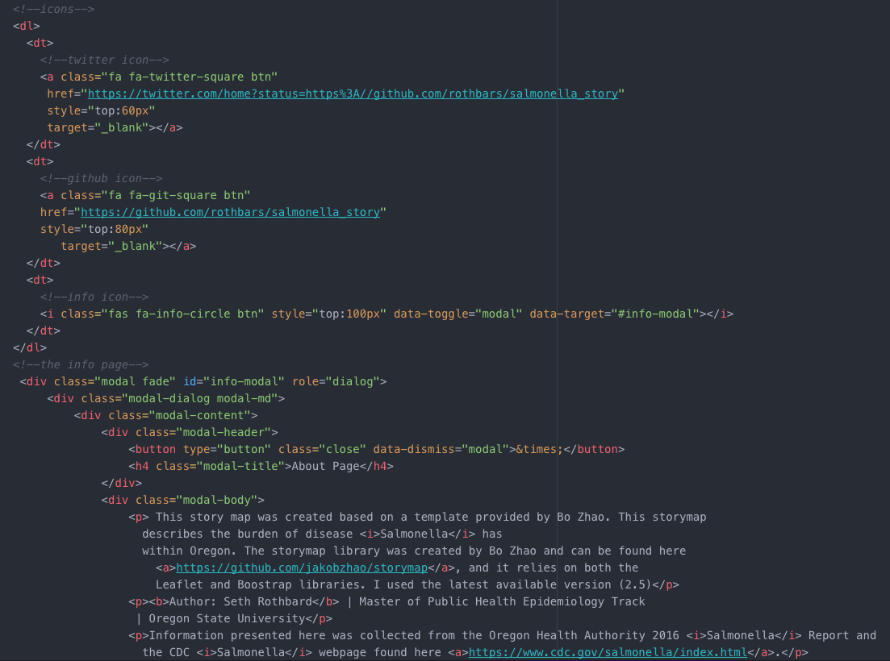

# Oregon *Salmonella* Story Map
This storymap was designed to provide a brief background into what the *Salmonella*
bacteria is and its unique effect and history in the state of Oregon. Much of the
information presented here can be found written in yearly reports by the Oregon
Health Authority but my hope is that by showing this information in a more interactive
context that it will be more easily understood by health officials and policy
makers within Oregon. The goal of this story map is to provide an alternative method to
present yearly *Salmonella* information compared to the written reports used now.

The website can be accessed [here](https://rothbars.github.io/salmonellastory/)

## Storyline of the Map
1. The story will begin by providing background details, definitions, and other
necessary information to understand the *Salmonella* bacteria are and what it
causes. Next, I will move into the unique history Oregon has involving the bacteria.
Oregon was home to the largest domestic bioterrorist attack in US history in 1984.
This attack has shaped the public health response to acute outbreaks not only within
Oregon, but nationwide. I hope this background and history section will naturally
lead to the current state of *Salmonella* surveillance in the state.
2. Next, I will examine the current trends of *Salmonella* incidence within Oregon.
I will address trends of specific serotypes of *Salmonella* (groups of *Salmonella*
with similar surface features) and the response from Oregon public health officials.
Specific high-risk groups will be identified and infection rates in Oregon will also
be compared to the US average infection rate. **Important Note** I hope to expand
this section in the future with a more detailed statistical analysis of the spatial
distribution of *Salmonella* infections within Oregon. I hope to bring more interactivity
with the choropleth map such as a hover feature and actually have the choropleth as part of
the website rather than a static image.
3. Finally, I will highlight expectations for the future such as elaborate on how disease
trends may change due to environmental influences. I will explain current response
and intervention efforts and how these may change in the future. In this section
I also will introduce an important stakeholder in this research (the Oregon Health
Authority). Much of the information presented here is based on their surveillance
efforts and the more in-depth statistical analysis I hope to bring into the story
map is based on data collected by this agency.

## Technical Summary
The storymap presented here has a fairly basic architecture setup. In addition to the
main index.html and README files there are four main folders. The assets folder contains
the Oregon counties geoJson data as well as video files, the css folder holds relevant
styling code for the story map, the img folder contains all static images, and the js
folder contains the javascript for the storymap.
As mentioned above interactivity is limited but I hope to expand this in the future,
the map currently looks like this.  
A function my map does have is an about page which can be toggled on/off, a link to my personal GitHub page, and the ability to link it to other people via Twitter. A sample of that code can be
viewed here.  

## Design Reflection
I set out to create a fairly simple map with minimal clutter so as to not distract the
viewer. Over the course of my analysis I quickly began to realize that the data I was
using to create my choropleth map was not designed with spatial analysis in mind and
therefore needed considerable cleaning in order to be used. So far I am only able to
show this data as a choropleth map by images from R Studio, but my immediate goal
is to make these data a part of the website. This data contained the county
name where a case was reported, therefore I had to spatially join these
observations with centroid coordinates from oregon county polygon data. I think
by using the Shiny package in R I would be able to create Leaflet maps more easily
as my maps are already present within R.

## Data source
Data was obtained from the Oregon Health Authority Northwest Center for Foodborne
Outbreak Management, Epidemiology and Surveillance. Population estimates to calculate
rates were obtained from the Population Research Center at Portland State University.
The Oregon county geojson data was provided by Mike Bostock of D3, and the polygon
data used for the R analysis was downloaded from the Oregon Spatial Data Library.

## Libraries
### CSS
1. Bootstrap
2. Leaflet
3. Animate
4. Google Fonts (Roboto Family)
5. Storymap
### JavaScript
1. Leaflet
2. JQuery
3. Popper
4. Bootstrap
5. Storymap

## Credits and Acknowledgement
This storymap of Oregon was created with the help of Bo Zhao and it was built
using the storymap libraries he created. This map was created by me, Seth Rothbard,
using templates created/provided by Bo Zhao. All health data was obscured to the
county level to protect individual privacy and was de-identified by data managers
at the Oregon Health Authority prior to analysis.
